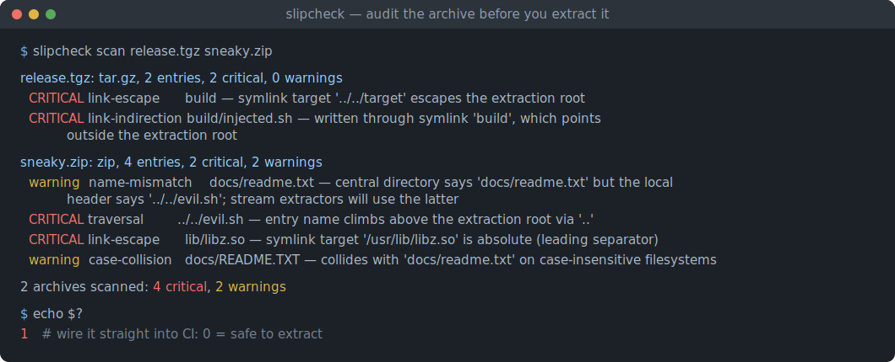
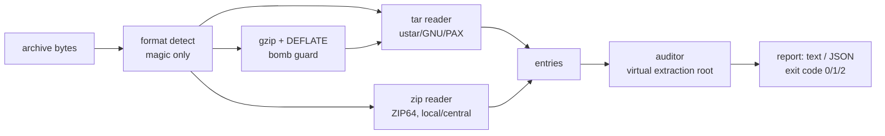

# slipcheck

[English](README.md) | [中文](README.zh.md) | [日本語](README.ja.md)

[](LICENSE) [](Cargo.toml)  [](CONTRIBUTING.md)

**オープンソースのアーカイブ監査ツール——展開する前に、tar・tar.gz・zip の中のパストラバーサル、シンボリックリンク脱出、setuid ビット、絶対パスをすべて検出する。**



```bash
git clone https://github.com/JaydenCJ/slipcheck.git && cargo install --path slipcheck
```

## なぜ slipcheck？

Zip-slip は決して死なない：どの展開ライブラリも自分のトラバーサルバグを直し続け、新しい展開ツールがまたそれを持ち込む——PAX `path` 上書き、GNU ロングネーム、中央ディレクトリと食い違う zip ローカルヘッダ、あるいは一つ前のエントリでシンボリックリンクを仕込み、その先へファイルを書き込む手口を通じて。その一方で CI パイプラインは毎日、信頼できない tarball を展開し、今週の展開ツールが全部検証してくれることを祈っている。slipcheck は向きを逆にする：展開ツールを信頼する代わりに、*アーカイブそのもの*を監査する——静的バイナリ一つ、三つのフォーマット、1 バイトも書き込まれる前に。エントリを仮想展開ルートに再生し、カーネルと同じ流儀でシンボリックリンクの連鎖を解決し、zip の二つの名前表を突き合わせ、CI 向けの終了コードとともにテキストまたは JSON で報告する。

|  | slipcheck | GNU tar デフォルト | Python `tarfile`（`data` フィルタ） | unzip |
|---|---|---|---|---|
| 展開前に監査 | はい——何も書き込まない | いいえ、自身の展開のみ保護 | いいえ、展開中にフィルタ | いいえ |
| 対応フォーマット | tar + tar.gz + zip を一つで | tar のみ | tar のみ | zip のみ |
| シンボリックリンク越し書き込みの検出 | はい、連鎖を完全解決 | 部分的（エントリ順に依存） | 部分的 | いいえ |
| zip ローカル/中央の名前突き合わせ | はい、両方の名前を監査 | 対象外 | 対象外 | いいえ |
| setuid / setgid / デバイスノード報告 | はい、検出項目として | 黙って剥がすか適用する | 展開時に例外 | モードを無視 |
| 大文字小文字衝突・重複パス検査 | はい | いいえ | いいえ | 重複のみ警告 |
| CI との契約 | JSON + 終了コード 0/1/2 | なし | プロセス内例外 | 終了コードが不統一 |

<sub>各行の主張は GNU tar 1.35、Python 3.12 `tarfile`、Info-ZIP unzip 6.0 のドキュメントで検証、2026-07。</sub>

## 特長

- **監査してから展開**——アーカイブは決して展開されない；slipcheck はメタデータだけを読むため、悪意あるファイルのスキャンは構造的に安全で、`slipcheck scan pkg.tgz --quiet && tar -xzf pkg.tgz` が展開を再び退屈な作業に戻す。
- **二段階 zip-slip を捕捉**——`build -> ../../target` のリンクを仕込んでから `build/injected.sh` を書く手口は素朴な名前検査をすり抜ける；slipcheck はアーカイブ自身が仕込んだリンク越しの書き込みを、連鎖もループも含めてすべて解決する。
- **zip の二つの名前表を突き合わせ**——一覧ツールは中央ディレクトリを、ストリーム展開ツールはローカルヘッダを信じる；食い違えば slipcheck は不一致を報告し、*かつ*密輸された名前も監査する。
- **敵対的メタデータは解析しても信頼しない**——PAX `path`/`linkpath` 上書き、GNU ロングネーム、base-256 サイズ、ZIP64、バックスラッシュ区切り、ドライブレターをすべて復号してから裁く；読めないリンク先はフェイルクローズで検出項目になる。
- **爆弾ガード内蔵**——ツリー内 DEFLATE 展開器は出力を `--max-unpacked`（デフォルト 1 GiB）で制限；超過したストリームは critical な `unpack-limit` 検出項目になり、OOM には決してならない。
- **依存ゼロ・書き込みゼロ**——gzip/DEFLATE 層まで含めて std のみ、ネットワークなし、テレメトリなし；12 の検査は安定 id を持ち、既知の誤検知は `--allow` で id 単位に抑制できる。

## クイックスタート

インストール（Rust 1.75+ が必要）：

```bash
git clone https://github.com/JaydenCJ/slipcheck.git && cargo install --path slipcheck
```

リポジトリ同梱の敵対的フィクスチャをスキャンする：

```bash
slipcheck scan examples/fixtures/symlink-escape.tar examples/fixtures/sneaky.zip
```

出力（実測）：

```text
examples/fixtures/symlink-escape.tar: tar, 2 entries, 2 critical, 0 warnings
  CRITICAL link-escape      build — symlink target '../../target' escapes the extraction root
  CRITICAL link-indirection build/injected.sh — written through symlink 'build', which points outside the extraction root
examples/fixtures/sneaky.zip: zip, 4 entries, 2 critical, 2 warnings
  warning  name-mismatch    docs/readme.txt — central directory says 'docs/readme.txt' but the local header says '../../evil.sh'; stream extractors will use the latter
  CRITICAL traversal        ../../evil.sh — entry name climbs above the extraction root via '..'
  CRITICAL link-escape      lib/libz.so — symlink target '/usr/lib/libz.so' is absolute (leading separator)
  warning  case-collision   docs/README.TXT — collides with 'docs/readme.txt' on case-insensitive filesystems
2 archives scanned: 4 critical, 2 warnings
```

終了コードで CI ステップにゲートを掛ける（0 = 安全、1 = 検出あり、2 = 読み取り不能）：

```bash
slipcheck scan release.tar.gz --quiet && tar -xzf release.tar.gz -C build/
curl -sSf https://example.test/pkg.tgz | slipcheck scan - --json
```

## 検査項目

12 の検査、kebab-case の安定 id（`slipcheck checks` がこの表を表示する）。どれも `--allow <id>` で抑制でき、`--fail-on warning` でゲートを厳格化できる。

| ID | 深刻度 | 意味 |
|---|---|---|
| `absolute-path` | critical | エントリ名が絶対パス（先頭 `/`、ドライブレター、UNC） |
| `traversal` | critical | エントリ名が `..` で展開ルートの外へ這い上がる |
| `link-escape` | critical | シンボリックリンク／ハードリンクの先がルート外に解決される |
| `link-indirection` | critical | 先に仕込まれたリンク越しに書き込まれる（内部に留まる場合は warning） |
| `setuid` / `setgid` | critical | ファイルモードが setuid / setgid ビットを持つ |
| `world-writable` | warning | ファイルまたはディレクトリが全員書き込み可 |
| `special-file` | critical | デバイスノード（fifo と未知のエントリ種別は warning に降格） |
| `duplicate-path` | warning | 同じパスが複数回現れる；最後のエントリが黙って勝つ |
| `case-collision` | warning | 大文字小文字を区別しないファイルシステム上で二つのパスが衝突 |
| `name-mismatch` | warning | zip の中央ディレクトリとローカルヘッダで名前が食い違う |
| `unpack-limit` | critical | ストリームが `--max-unpacked` を超えて膨張（解凍爆弾ガード） |

## 検証

このリポジトリは CI を同梱しない；上記の主張はすべてローカル実行で検証される：`cargo test`（ユニット 96 + コンパイル済みバイナリに対する CLI 統合 21、すべてオフラインで、アーカイブのバイト列はワイヤフォーマットから直接構築）と `bash scripts/smoke.sh`——同梱フィクスチャに対しバイナリをエンドツーエンドで走らせ、`SMOKE OK` を出力しなければならない。

## アーキテクチャ



## ロードマップ

- [x] コア監査器：12 検査、リンク連鎖解決、tar/tar.gz/zip リーダー、ツリー内 DEFLATE、JSON 出力、CI 終了コード
- [ ] コンテナ追加：zstd・xz 圧縮 tar、入れ子アーカイブ（`.zip` 内の `.tar.gz`）
- [ ] 孤児 zip ローカルヘッダ（中央ディレクトリに載らないエントリ）の有界前方スキャン
- [ ] ポリシーファイル：リポジトリにコミットする許可リストと深刻度の上書き
- [ ] `--fix` モード：敵対的エントリを除去したサニタイズ済みコピーの出力

全リストは [open issues](https://github.com/JaydenCJ/slipcheck/issues) を参照。

## コントリビュート

コントリビューション歓迎——[CONTRIBUTING.md](CONTRIBUTING.md) を読み、[good first issue](https://github.com/JaydenCJ/slipcheck/issues?q=is%3Aissue+is%3Aopen+label%3A%22good+first+issue%22) から始めるか、[ディスカッション](https://github.com/JaydenCJ/slipcheck/discussions)を開いてほしい。

## ライセンス

[MIT](LICENSE)
