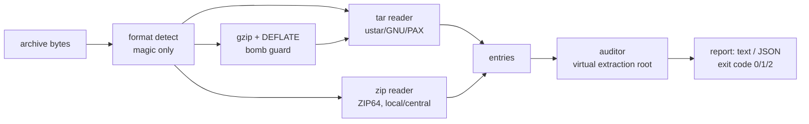

# slipcheck

[English](README.md) | [中文](README.zh.md) | [日本語](README.ja.md)

[](LICENSE) [](Cargo.toml)  [](CONTRIBUTING.md)

**Open-source archive auditor — catches path traversal, symlink escapes, setuid bits and absolute paths in tar, tar.gz and zip before you extract them.**


```bash
git clone https://github.com/JaydenCJ/slipcheck.git && cargo install --path slipcheck
```

## Why slipcheck?

Zip-slip never dies: every extractor library patches its own traversal bugs, and every new extractor reintroduces them — through PAX `path` overrides, GNU long names, zip local headers that disagree with the central directory, or a symlink planted one entry before the file that writes through it. Meanwhile CI pipelines extract untrusted tarballs daily and hope the extractor of the week validates everything. slipcheck flips the direction: instead of trusting the extractor, it audits *the archive itself* — one static binary, any of the three formats, before a single byte is written. It replays entries against a virtual extraction root, resolves symlink chains the way the kernel would, cross-checks zip's two name tables, and reports in text or JSON with exit codes made for CI.

|  | slipcheck | GNU tar defaults | Python `tarfile` (`data` filter) | unzip |
|---|---|---|---|---|
| Audits before extraction | yes — nothing is written | no, guards only its own extraction | no, filters during extraction | no |
| Formats | tar + tar.gz + zip, one tool | tar only | tar only | zip only |
| Write-through-symlink detection | yes, full chain resolution | partial (member ordering dependent) | partial | no |
| zip local/central name cross-check | yes, and audits both names | n/a | n/a | no |
| setuid / setgid / device reporting | yes, as findings | silently strips or applies | raises on extraction | ignores mode |
| Case-collision & duplicate-path checks | yes | no | no | warns on duplicates only |
| CI contract | JSON + exit codes 0/1/2 | no | exceptions in-process | exit codes vary |

<sub>Row claims verified against GNU tar 1.35, Python 3.12 `tarfile` and Info-ZIP unzip 6.0 documentation, 2026-07.</sub>

## Features

- **Audit, then extract** — the archive is never unpacked; slipcheck reads metadata only, so scanning a hostile file is safe by construction, and `slipcheck scan pkg.tgz --quiet && tar -xzf pkg.tgz` makes extraction boring again.
- **The two-step zip-slip is caught** — a symlink planted at `build -> ../../target` followed by `build/injected.sh` passes naive name checks; slipcheck resolves every write through the symlinks the archive itself planted, chains and loops included.
- **Zip's two name tables are cross-checked** — listers trust the central directory, stream extractors trust local headers; when they disagree slipcheck reports the mismatch *and* audits the smuggled name too.
- **Hostile metadata is parsed, not trusted** — PAX `path`/`linkpath` overrides, GNU long names, base-256 sizes, ZIP64, backslash separators and drive letters are all decoded and then judged; unreadable symlink targets fail closed as findings.
- **Bomb guard built in** — the in-tree DEFLATE decompressor caps output at `--max-unpacked` (default 1 GiB); a stream that blows past it becomes a critical `unpack-limit` finding, never an OOM.
- **Zero dependencies, zero writes** — std-only including the gzip/DEFLATE layer, no network, no telemetry; twelve checks, each suppressible per-id with `--allow` when a finding is a known false alarm for your corpus.

## Quickstart

Install (requires Rust 1.75+):

```bash
git clone https://github.com/JaydenCJ/slipcheck.git && cargo install --path slipcheck
```

Scan the hostile fixtures that ship in this repository:

```bash
slipcheck scan examples/fixtures/symlink-escape.tar examples/fixtures/sneaky.zip
```

Output (captured):

```text
examples/fixtures/symlink-escape.tar: tar, 2 entries, 2 critical, 0 warnings
  CRITICAL link-escape      build — symlink target '../../target' escapes the extraction root
  CRITICAL link-indirection build/injected.sh — written through symlink 'build', which points outside the extraction root
examples/fixtures/sneaky.zip: zip, 4 entries, 2 critical, 2 warnings
  warning  name-mismatch    docs/readme.txt — central directory says 'docs/readme.txt' but the local header says '../../evil.sh'; stream extractors will use the latter
  CRITICAL traversal        ../../evil.sh — entry name climbs above the extraction root via '..'
  CRITICAL link-escape      lib/libz.so — symlink target '/usr/lib/libz.so' is absolute (leading separator)
  warning  case-collision   docs/README.TXT — collides with 'docs/readme.txt' on case-insensitive filesystems
2 archives scanned: 4 critical, 2 warnings
```

Gate a CI step on the exit code (0 = safe, 1 = findings, 2 = unreadable):

```bash
slipcheck scan release.tar.gz --quiet && tar -xzf release.tar.gz -C build/
curl -sSf https://example.test/pkg.tgz | slipcheck scan - --json
```

## Checks

Twelve checks, stable kebab-case ids (`slipcheck checks` prints this table). Suppress any of them with `--allow <id>`; tighten the gate with `--fail-on warning`.

| ID | Severity | Meaning |
|---|---|---|
| `absolute-path` | critical | Entry name is absolute (leading `/`, drive letter or UNC) |
| `traversal` | critical | Entry name climbs out of the extraction root via `..` |
| `link-escape` | critical | Symlink or hard link target resolves outside the root |
| `link-indirection` | critical | Entry written through an earlier in-archive symlink (warning when it stays inside) |
| `setuid` / `setgid` | critical | File mode carries the setuid / setgid bit |
| `world-writable` | warning | File or directory is world-writable |
| `special-file` | critical | Device node (fifos and unknown entry types downgrade to warning) |
| `duplicate-path` | warning | Same path appears more than once; the last entry silently wins |
| `case-collision` | warning | Two paths collide on case-insensitive filesystems |
| `name-mismatch` | warning | zip central directory and local header disagree on a name |
| `unpack-limit` | critical | Stream inflates past `--max-unpacked` (decompression bomb guard) |

## Verification

This repository ships no CI; every claim above is verified by local runs: `cargo test` (96 unit + 21 CLI integration tests, all offline, archive bytes built from the wire format up) and `bash scripts/smoke.sh`, which drives the compiled binary against the committed fixtures end to end and must print `SMOKE OK`.

## Architecture



## Roadmap

- [x] Core auditor: 12 checks, symlink-chain resolution, tar/tar.gz/zip readers, in-tree DEFLATE, JSON output, CI exit codes
- [ ] More containers: zstd and xz compressed tars, nested archives (`.tar.gz` inside `.zip`)
- [ ] Orphan zip local headers (entries absent from the central directory) via a bounded forward scan
- [ ] Policy files: per-repository allow lists and severity overrides checked into the repo
- [ ] `--fix` mode emitting a sanitized copy of the archive with hostile entries dropped

See the [open issues](https://github.com/JaydenCJ/slipcheck/issues) for the full list.

## Contributing

Contributions are welcome — see [CONTRIBUTING.md](CONTRIBUTING.md), start with a [good first issue](https://github.com/JaydenCJ/slipcheck/issues?q=is%3Aissue+is%3Aopen+label%3A%22good+first+issue%22) or open a [discussion](https://github.com/JaydenCJ/slipcheck/discussions).

## License

[MIT](LICENSE)
