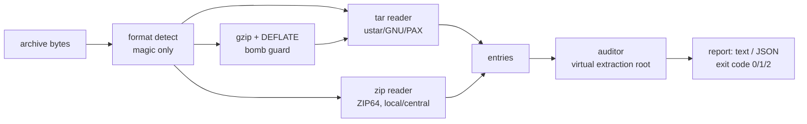

# slipcheck

[English](README.md) | [中文](README.zh.md) | [日本語](README.ja.md)

[](LICENSE) [](Cargo.toml)  [](CONTRIBUTING.md)

**开源归档审计器——在解压之前，就把 tar、tar.gz、zip 里的路径穿越、符号链接逃逸、setuid 位和绝对路径全部揪出来。**


```bash
git clone https://github.com/JaydenCJ/slipcheck.git && cargo install --path slipcheck
```

## 为什么选 slipcheck？

Zip-slip 从未真正消失：每个解压库都在修自己的穿越漏洞，而每个新解压器又把它们重新引入——通过 PAX `path` 覆盖、GNU 长文件名、zip 本地头与中央目录不一致，或者先埋一个符号链接、下一个条目再穿过它写文件。与此同时，CI 流水线每天都在解压不受信任的 tarball，指望本周流行的解压器把一切都校验好。slipcheck 把方向反了过来：不再信任解压器，而是审计*归档本身*——一个静态二进制，覆盖三种格式，在写入任何一个字节之前完成。它把条目重放到一个虚拟解压根上，按内核的方式解析符号链接链，交叉核对 zip 的两张名字表，并以文本或 JSON 输出、配合为 CI 设计的退出码。

|  | slipcheck | GNU tar 默认行为 | Python `tarfile`（`data` 过滤器） | unzip |
|---|---|---|---|---|
| 解压前审计 | 是——不写入任何内容 | 否，只保护自己的解压过程 | 否，在解压过程中过滤 | 否 |
| 支持格式 | tar + tar.gz + zip，一个工具 | 仅 tar | 仅 tar | 仅 zip |
| 穿过符号链接写入的检测 | 是，完整链式解析 | 部分（依赖条目顺序） | 部分 | 否 |
| zip 本地头/中央目录交叉核对 | 是，且两个名字都审计 | 不适用 | 不适用 | 否 |
| setuid / setgid / 设备节点报告 | 是，作为发现项 | 静默剥离或直接应用 | 解压时抛异常 | 忽略权限位 |
| 大小写冲突与重复路径检查 | 是 | 否 | 否 | 仅对重复项告警 |
| CI 契约 | JSON + 退出码 0/1/2 | 无 | 进程内异常 | 退出码不统一 |

<sub>各行结论对照 GNU tar 1.35、Python 3.12 `tarfile` 与 Info-ZIP unzip 6.0 文档核实，2026-07。</sub>

## 特性

- **先审计，再解压**——归档永远不会被展开；slipcheck 只读元数据，因此扫描恶意文件在结构上就是安全的，`slipcheck scan pkg.tgz --quiet && tar -xzf pkg.tgz` 让解压重新变得无聊。
- **两步式 zip-slip 无处遁形**——先埋 `build -> ../../target` 符号链接、再写 `build/injected.sh` 能骗过朴素的名字检查；slipcheck 会沿归档自己埋下的符号链接解析每一次写入，链条和环路都算在内。
- **zip 的两张名字表交叉核对**——列表工具信中央目录，流式解压器信本地头；两者不一致时 slipcheck 既报告不匹配，*也*把被夹带的名字一并审计。
- **恶意元数据只解析、不信任**——PAX `path`/`linkpath` 覆盖、GNU 长文件名、base-256 大小、ZIP64、反斜杠分隔符和盘符全部先解码再审判；无法读取的符号链接目标按"失败即拒绝"处理为发现项。
- **内置炸弹防护**——树内 DEFLATE 解压器以 `--max-unpacked`（默认 1 GiB）为输出上限；超限的流会变成一条 critical 的 `unpack-limit` 发现项，绝不会 OOM。
- **零依赖、零写入**——连 gzip/DEFLATE 层都是纯 std，无网络、无遥测；十二项检查各有稳定 id，语料库里已知的误报可用 `--allow` 按 id 精确压制。

## 快速上手

安装（需要 Rust 1.75+）：

```bash
git clone https://github.com/JaydenCJ/slipcheck.git && cargo install --path slipcheck
```

扫描仓库里自带的恶意样例：

```bash
slipcheck scan examples/fixtures/symlink-escape.tar examples/fixtures/sneaky.zip
```

输出（实测捕获）：

```text
examples/fixtures/symlink-escape.tar: tar, 2 entries, 2 critical, 0 warnings
  CRITICAL link-escape      build — symlink target '../../target' escapes the extraction root
  CRITICAL link-indirection build/injected.sh — written through symlink 'build', which points outside the extraction root
examples/fixtures/sneaky.zip: zip, 4 entries, 2 critical, 2 warnings
  warning  name-mismatch    docs/readme.txt — central directory says 'docs/readme.txt' but the local header says '../../evil.sh'; stream extractors will use the latter
  CRITICAL traversal        ../../evil.sh — entry name climbs above the extraction root via '..'
  CRITICAL link-escape      lib/libz.so — symlink target '/usr/lib/libz.so' is absolute (leading separator)
  warning  case-collision   docs/README.TXT — collides with 'docs/readme.txt' on case-insensitive filesystems
2 archives scanned: 4 critical, 2 warnings
```

用退出码给 CI 步骤上闸（0 = 安全，1 = 有发现项，2 = 无法读取）：

```bash
slipcheck scan release.tar.gz --quiet && tar -xzf release.tar.gz -C build/
curl -sSf https://example.test/pkg.tgz | slipcheck scan - --json
```

## 检查项

十二项检查，kebab-case 的稳定 id（`slipcheck checks` 会打印本表）。任意一项可用 `--allow <id>` 压制；用 `--fail-on warning` 收紧闸门。

| ID | 严重级别 | 含义 |
|---|---|---|
| `absolute-path` | critical | 条目名是绝对路径（前导 `/`、盘符或 UNC） |
| `traversal` | critical | 条目名通过 `..` 爬出解压根目录 |
| `link-escape` | critical | 符号链接或硬链接目标解析到根目录之外 |
| `link-indirection` | critical | 条目穿过归档中先埋下的符号链接写入（落点仍在内部时降级为 warning） |
| `setuid` / `setgid` | critical | 文件权限位携带 setuid / setgid |
| `world-writable` | warning | 文件或目录全局可写 |
| `special-file` | critical | 设备节点（fifo 与未知条目类型降级为 warning） |
| `duplicate-path` | warning | 同一路径出现多次；最后一个条目悄悄获胜 |
| `case-collision` | warning | 两条路径在大小写不敏感的文件系统上冲突 |
| `name-mismatch` | warning | zip 中央目录与本地头的名字不一致 |
| `unpack-limit` | critical | 流膨胀超过 `--max-unpacked`（解压炸弹防护） |

## 验证

本仓库不附带任何 CI；上述每一条主张都由本地运行验证：`cargo test`（96 个单元测试 + 21 个针对编译产物的 CLI 集成测试，全部离线，归档字节从线上格式层手工构造）以及 `bash scripts/smoke.sh`——它端到端驱动编译好的二进制扫过全部内置样例，必须打印 `SMOKE OK`。

## 架构



## 路线图

- [x] 核心审计器：12 项检查、符号链接链解析、tar/tar.gz/zip 读取器、树内 DEFLATE、JSON 输出、CI 退出码
- [ ] 更多容器：zstd 与 xz 压缩的 tar、嵌套归档（`.zip` 里的 `.tar.gz`）
- [ ] 孤儿 zip 本地头（中央目录中不存在的条目），通过有界前向扫描发现
- [ ] 策略文件：随仓库提交的按仓库放行清单与严重级别覆盖
- [ ] `--fix` 模式：输出剔除恶意条目后的净化副本

完整列表见[开放 issue](https://github.com/JaydenCJ/slipcheck/issues)。

## 参与贡献

欢迎贡献——请阅读 [CONTRIBUTING.md](CONTRIBUTING.md)，从 [good first issue](https://github.com/JaydenCJ/slipcheck/issues?q=is%3Aissue+is%3Aopen+label%3A%22good+first+issue%22) 入手，或发起一个[讨论](https://github.com/JaydenCJ/slipcheck/discussions)。

## 许可证

[MIT](LICENSE)
